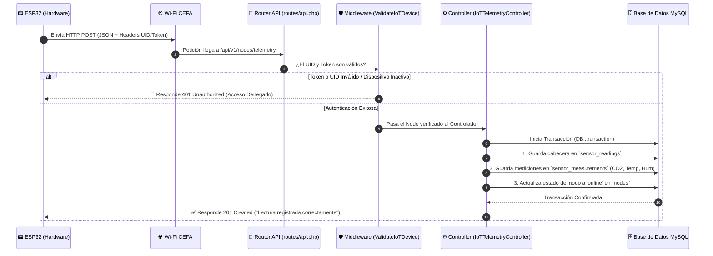

# 📡 Manual y Explicación Paso a Paso: API REST de Telemetría IoT — AirSense CEFA

Bienvenido a la documentación técnica de la **API REST de Telemetría IoT** de AirSense CEFA.

Este documento está escrito de forma **súper clara, visual y sencilla**, pensado para que cualquier desarrollador (incluso si estás empezando desde cero en el mundo de las APIs) entienda al 100% **cómo se construyó, cómo funciona y cómo defenderla en una presentación o sustentación del proyecto**.

---

## 💡 1. ¿Qué es esta API y para qué la necesitamos?

### El Problema:
El microcontrolador **ESP32** instalado en un aula de clase lee el CO₂ (sensor MH-Z16) y la temperatura/humedad (sensor DHT11). Sin embargo, el ESP32 no puede conectarse directamente a la base de datos MySQL por razones de seguridad y rendimiento.

### La Solución (La API REST):
La **API REST** es como una **"Ventanilla de Recepción Digital"** que pusimos en nuestro servidor Laravel. 
1. El ESP32 se conecta al Wi-Fi del CEFA.
2. Cada minuto envía un paquete de datos en formato **JSON** a nuestra ventanilla (API).
3. Nuestra API recibe el paquete, verifica la identidad del ESP32, guarda los datos en MySQL y le responde al ESP32: *"¡Recibido con éxito!"*.

---

## 🗺️ 2. El Viaje del Dato: Flujo Paso a Paso (Diagrama)



---

## 📂 3. Archivos Creados y su Función Explicada

Construimos **7 archivos principales** organizados en la arquitectura MVC de Laravel:

```text
c:\laragon\www\airsense-cefa\
├── app/
│   ├── Http/
│   │   ├── Controllers/Api/v1/
│   │   │   └── IoTTelemetryController.php   <-- ⚙️ El Cerebro que procesa y guarda
│   │   └── Middleware/
│   │       └── ValidateIoTDevice.php        <-- 🛡️ El Guardián que valida la clave
│   └── Models/
│       ├── Node.php                         <-- 📦 Modelo para la tabla `nodes`
│       ├── Environment.php                  <-- 📦 Modelo para la tabla `environments`
│       ├── SensorReading.php                <-- 📦 Modelo para la tabla `sensor_readings`
│       └── SensorMeasurement.php            <-- 📦 Modelo para la tabla `sensor_measurements`
├── bootstrap/
│   └── app.php                              <-- 🔌 Registra la ruta de la API
└── routes/
    └── api.php                              <-- 🚦 Define las URLs públicas de la API
```

---

## 🔍 4. Explicación Detallada Código por Código

### 1️⃣ El Router (`routes/api.php`):
Es la puerta de entrada. Le dice a Laravel qué URL debe responder:

```php
Route::prefix('v1/nodes')->group(function () {
    Route::middleware([ValidateIoTDevice::class])->group(function () {
        Route::post('telemetry', [IoTTelemetryController::class, 'store']);
        Route::post('ping', [IoTTelemetryController::class, 'ping']);
    });
});
```
- **URL generada**: `http://tu-servidor/api/v1/nodes/telemetry`
- **Método**: `POST` (porque el ESP32 está *enviando/creando* información).
- **Middleware**: Antes de llamar al controlador, obliga a ejecutar `ValidateIoTDevice`.

---

### 2️⃣ El Guardián de Seguridad (`app/Http/Middleware/ValidateIoTDevice.php`):
Evita que hackers o personas extrañas envíen datos falsos a la base de datos.

**¿Cómo funciona la seguridad?**
1. El ESP32 envía 2 encabezados HTTP:
   - `X-Device-UID`: El número de cédula del ESP32 (ej: `ESP32_XX5R69`).
   - `X-Device-Token`: La clave secreta (ej: `secret_token_abc123`).
2. El Middleware busca el nodo en la tabla `nodes` por su `device_uid`.
3. Compara el token usando **`Hash::check($token, $nodo->device_token_hash)`**.
   > 🔐 **¿Por qué Hash?**: En la base de datos NUNCA guardamos la clave en texto plano. Guardamos un *hash* encriptado. `Hash::check()` verifica si la clave que mandó el ESP32 coincide con el hash guardado sin descifrarlo.

---

### 3️⃣ El Controlador de Ingesta (`app/Http/Controllers/Api/v1/IoTTelemetryController.php`):
Es el encargado de procesar la información y guardarla de forma segura.

**Pasos clave del método `store()`**:

1. **Validación del JSON recibido**:
   Verifica que el JSON contenga el arreglo `measurements` y que las variables sean válidas (`co2`, `temperature`, `humidity`).

2. **Transacción de Base de Datos (`DB::transaction`)**:
   > 💡 **¿Qué es una transacción?**: Es un principio de "Todo o Nada". Si por alguna razón se guarda el CO₂ pero falla al guardar la temperatura, la transacción cancela todo (*rollback*) para que la base de datos nunca quede corrupta o con datos incompletos.

3. **Insección en `sensor_readings` (Cabecera)**:
   Crea un registro general indicando el `node_id`, el `environment_id` (aula), la fecha de medición y guarda el JSON completo en `raw_payload` para auditoría.

4. **Inserción en `sensor_measurements` (Detalle)**:
   Itera sobre cada variable recibida e inserta una fila por cada medición:
   - Fila 1: `variable_type = co2`, `value = 645.5`, `unit = ppm`
   - Fila 2: `variable_type = temperature`, `value = 25.2`, `unit = °C`
   - Fila 3: `variable_type = humidity`, `value = 60.0`, `unit = %`

5. **Actualización de Estado del Hardware**:
   Actualiza el nodo en la tabla `nodes`:
   - `connectivity_status = 'online'`
   - `last_seen_at = now()`

6. **Respuesta HTTP 201 Created**:
   Le responde al ESP32 en milisegundos un código HTTP `201` confirmando el éxito.

---

## 🧪 5. Ejemplo de Petición y Respuesta HTTP Real

### Petición Enviada por el ESP32 (HTTP POST):
* **URL**: `http://127.0.0.1:8000/api/v1/nodes/telemetry`
* **Headers**:
  ```text
  Content-Type: application/json
  Accept: application/json
  X-Device-UID: ESP32_XX5R69
  X-Device-Token: secret_token_abc123
  ```
* **Body (JSON)**:
  ```json
  {
    "device_uid": "ESP32_XX5R69",
    "measured_at": "2026-09-26 12:00:00",
    "measurements": [
      { "variable_type": "co2", "value": 645.5, "unit": "ppm" },
      { "variable_type": "temperature", "value": 25.2, "unit": "°C" },
      { "variable_type": "humidity", "value": 60.0, "unit": "%" }
    ]
  }
  ```

### Respuesta Exitosa enviada por Laravel (`HTTP 201 Created`):
```json
{
  "status": "success",
  "message": "Lectura y mediciones registradas correctamente.",
  "reading_id": 1,
  "node_id": 1,
  "device_uid": "ESP32_XX5R69",
  "received_at": "2026-09-26 17:37:46"
}
```

---

## ❓ 6. Banco de Preguntas y Respuestas para Sustentaciones (SENA / Evaluadores)

Si un jurado o instructor te pregunta sobre la API, responde con estas palabras clave:

### ❓ Pregunta 1: *"¿Por qué eligieron una arquitectura relacional de dos tablas (`sensor_readings` y `sensor_measurements`) en lugar de poner todo en una sola tabla?"*
> 🗣️ **Respuesta**: *"Por principios de **normalización de bases de datos** y **escalabilidad**. La tabla `sensor_readings` actúa como la cabecera del evento de transmisión (quién, dónde y cuándo), mientras que `sensor_measurements` almacena en filas independientes cada variable (`co2`, `temperature`, `humidity`). Si el día de mañana agregamos un sensor de ruido o material particulado, no tenemos que alterar la estructura de la base de datos; simplemente enviamos una nueva variable en el arreglo."*

---

### ❓ Pregunta 2: *"¿Cómo garantizan la seguridad para que nadie envíe datos falsos a la API?"*
> 🗣️ **Respuesta**: *"Implementamos un **Middleware personalizado de autenticación de hardware** (`ValidateIoTDevice`). Cada petición debe incluir los encabezados `X-Device-UID` y `X-Device-Token`. En la base de datos guardamos el hash encriptado de la clave usando Bcrypt (`Hash::make`). El middleware valida con `Hash::check` antes de permitir que la petición toque el controlador."*

---

### ❓ Pregunta 3: *"¿Qué pasa si la base de datos falla a mitad de la inserción de datos?"*
> 🗣️ **Respuesta**: *"Encapsulamos todo el proceso de guardado dentro de una **Transacción de Base de Datos (`DB::transaction`)**. Esto garantiza el principio **ACID** de atomicidad: si alguna inserción de las mediciones falla, se realiza un rollback automático y no se guardan datos corruptos o incompletos."*

---

### ❓ Pregunta 4: *"¿Qué sucede si un ESP32 no tiene aún un ambiente asignado por el Administrador?"*
> 🗣️ **Respuesta**: *"El controlador cuenta con un mecanismo de resguardo (fallback): si el nodo no tiene un `environment_id` asignado en la tabla `nodes`, la API asigna automáticamente la lectura a un ambiente temporal con código `'UNASSIGNED'` ('Sin Asignar'). Esto evita fallos de clave foránea y permite que el Administrador relacione el nodo posteriormente desde el panel web."*

---
*Documentación oficial de backend • AirSense CEFA - SENA La Angostura*
