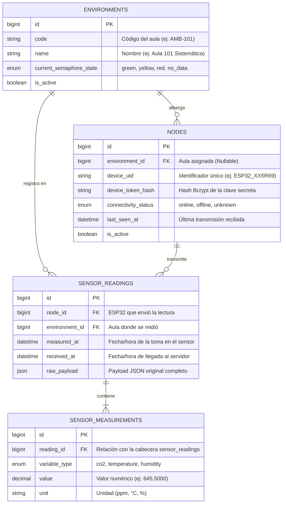

# 📡 Guía Definitiva y Documentación Técnica: API REST de Telemetría IoT — AirSense CEFA

Bienvenido a la documentación técnica detallada de la **API REST de Telemetría IoT** de AirSense CEFA.

Este documento está diseñado de forma **didáctica, profunda y estructurada paso a paso**, pensado para que cualquier desarrollador (incluso si está comenzando desde cero en desarrollo web y Laravel) entienda a la perfección **cómo funciona la API, cómo se conecta con MySQL, cómo se guardan las mediciones y cómo defender el proyecto en una sustentación técnica (SENA o clientes)**.

---

## 💡 1. Conceptos Básicos: ¿Qué es esta API y cómo funciona?

### 🔴 El Reto Técnico:
El microcontrolador **ESP32** (instalado en un ambiente o aula de clase) toma lecturas físicas de calidad del aire:
* **CO₂ (Dióxido de Carbono)** con el sensor MH-Z16 / NDIR en PPM.
* **Temperatura y Humedad** con el sensor DHT11 en °C y %.

Los microcontroladores no se conectan directamente a una base de datos MySQL por razones de seguridad, red y arquitectura.

### 🟢 La Solución (La API REST de Laravel):
Una **API REST** es un punto de entrada HTTP en nuestro servidor web que recibe peticiones en formato estructurado (JSON), valida que vengan de una fuente confiable y realiza la persistencia de datos en la base de datos.

```text
[ Sensor DHT11 + MH-Z16 ] ──> [ ESP32 (Wi-Fi) ] ──(HTTP POST JSON)──> [ API Laravel ] ──(Eloquent ORM)──> [ MySQL DB ]
```

---

## 🗄️ 2. Arquitectura de Base de Datos y Tablas Involucradas

Para que los datos queden bien organizados y escalables, la base de datos relacional MySQL utiliza **4 tablas principales**:


```mermaid
erDiagram
    ENVIRONMENTS ||--o{ NODES : "alberga"
    ENVIRONMENTS ||--o{ SENSOR_READINGS : "registra en"
    NODES ||--o{ SENSOR_READINGS : "transmite"
    SENSOR_READINGS ||--|{ SENSOR_MEASUREMENTS : "contiene"

    ENVIRONMENTS {
        bigint id PK
        string code "Código del aula (ej: AMB-101)"
        string name "Nombre (ej: Aula 101 Sistemática)"
        enum current_semaphore_state "green, yellow, red, no_data"
        boolean is_active
    }

    NODES {
        bigint id PK
        bigint environment_id FK "Aula asignada (Nullable)"
        string device_uid "Identificador único (ej: ESP32_XX5R69)"
        string device_token_hash "Hash Bcrypt de la clave secreta"
        enum connectivity_status "online, offline, unknown"
        datetime last_seen_at "Última transmisión recibida"
        boolean is_active
    }

    SENSOR_READINGS {
        bigint id PK
        bigint node_id FK "ESP32 que envió la lectura"
        bigint environment_id FK "Aula donde se midió"
        datetime measured_at "Fecha/hora de la toma en el sensor"
        datetime received_at "Fecha/hora de llegada al servidor"
        json raw_payload "Payload JSON original completo"
    }

    SENSOR_MEASUREMENTS {
        bigint id PK
        bigint reading_id FK "Relación con la cabecera sensor_readings"
        enum variable_type "co2, temperature, humidity"
        decimal value "Valor numérico (ej: 645.5000)"
        string unit "Unidad (ppm, °C, %)"
    }
```

### 📋 Detalle de cada Tabla:

| Tabla | Función | Campos Clave |
| :--- | :--- | :--- |
| **`environments`** | Representa los ambientes físicos (aulas, laboratorios) del CEFA. | `id`, `code`, `name`, `current_semaphore_state` |
| **`nodes`** | Almacena los dispositivos físicos ESP32 registrados en el sistema. | `id`, `environment_id`, `device_uid`, `device_token_hash`, `connectivity_status` |
| **`sensor_readings`** | **Tabla Cabecera**: Registra el evento de transmisión (quién envió, cuándo y en qué aula). | `id`, `node_id`, `environment_id`, `measured_at`, `raw_payload` |
| **`sensor_measurements`** | **Tabla Detalle**: Almacena de forma normalizada cada variable individual. | `id`, `reading_id`, `variable_type`, `value`, `unit` |

> 🧠 **¿Por qué separar en Cabecera (`sensor_readings`) y Detalle (`sensor_measurements`)?**  
> Si mañana agregamos un sensor de **Partículas en suspensión (PM2.5)** o **Ruido (dB)**, **NO** necesitamos modificar la estructura de la base de datos. Simplemente agregamos una nueva fila en `sensor_measurements` con `variable_type = 'pm25'`.

---

## 🔌 3. ¿Cómo se conecta Laravel a la Base de Datos MySQL?

Laravel utiliza el archivo de configuración `.env` ubicado en la raíz del proyecto para conectarse a MySQL:

```ini
DB_CONNECTION=mysql
DB_HOST=127.0.0.1
DB_PORT=3306
DB_DATABASE=airsense_cefa
DB_USERNAME=root
DB_PASSWORD=
```

### El Rol de Eloquent ORM:
En lugar de escribir consultas SQL puras a mano (como `INSERT INTO sensor_readings...`), Laravel usa **Eloquent ORM** (Object-Relational Mapping). Eloquent convierte las tablas de MySQL en **Clases/Modelos de PHP**:

* La tabla `nodes` ──> Modelo PHP `App\Models\Node`
* La tabla `environments` ──> Modelo PHP `App\Models\Environment`
* La tabla `sensor_readings` ──> Modelo PHP `App\Models\SensorReading`
* La tabla `sensor_measurements` ──> Modelo PHP `App\Models\SensorMeasurement`

---

## 🛠️ 4. Flujo Paso a Paso: Desde que el ESP32 envía hasta que se guarda en MySQL

### 🛣️ Paso 1: Ruta y Petición HTTP (`routes/api.php`)
El ESP32 realiza una petición `HTTP POST` a la dirección URL:
`http://192.168.0.116:8000/api/v1/nodes/telemetry`

```php
Route::prefix('v1/nodes')->group(function () {
    Route::middleware([ValidateIoTDevice::class])->group(function () {
        Route::post('telemetry', [IoTTelemetryController::class, 'store']);
    });
});
```

---

### 🛡️ Paso 2: Autenticación del Hardware en el Middleware (`ValidateIoTDevice.php`)
Antes de llegar al controlador o tocar la base de datos, la petición pasa por el **Middleware Guardián**.

1. El middleware extrae dos cabeceras (Headers) de la petición HTTP:
   * `X-Device-UID`: El identificador único del hardware (ej: `ESP32_XX5R69`).
   * `X-Device-Token`: La clave secreta del hardware (ej: `secret_token_abc123`).

2. **Consulta a la tabla `nodes`**:
   Eloquent busca si existe ese nodo en MySQL:
   ```php
   $node = Node::where('device_uid', $deviceUid)->first();
   ```
   *(Consulta SQL generada por debajo: `SELECT * FROM nodes WHERE device_uid = 'ESP32_XX5R69' LIMIT 1;`)*

3. **Verificación de la Clave Encriptada (`Hash::check`)**:
   En la base de datos la clave **NUNCA** se guarda en texto plano, sino como un hash Bcrypt. El Middleware comprueba la clave enviada contra el hash guardado:
   ```php
   if (! Hash::check($deviceToken, $node->device_token_hash)) {
       return response()->json(['message' => 'Credenciales del dispositivo inválidas'], 401);
   }
   ```
4. Si la clave es correcta y el dispositivo está activo (`is_active = true`), la petición continúa hacia el controlador.

---

### ⚙️ Paso 3: Inserción Transaccional en el Controlador (`IoTTelemetryController.php`)

El método `store()` ejecuta el guardado en la base de datos utilizando **Transacciones de Base de Datos (`DB::transaction`)**:

```php
DB::transaction(function () use ($node, $validated, &$reading) {
    // 1. Obtener o asignar el ambiente (aula)
    $environmentId = $node->environment_id;
    if (! $environmentId) {
        $fallbackEnv = Environment::firstOrCreate(
            ['code' => 'UNASSIGNED'],
            ['name' => 'Sin Asignar', 'is_active' => true]
        );
        $environmentId = $fallbackEnv->id;
    }

    // 2. Insertar Registro Cabecera en `sensor_readings`
    $reading = SensorReading::create([
        'node_id' => $node->id,
        'environment_id' => $environmentId,
        'measured_at' => $validated['measured_at'] ?? now(),
        'received_at' => now(),
        'source' => 'online',
        'is_valid' => true,
        'raw_payload' => $validated,
    ]);

    // 3. Bucle para Insertar las Mediciones en `sensor_measurements`
    foreach ($validated['measurements'] as $measurement) {
        SensorMeasurement::create([
            'reading_id' => $reading->id,
            'variable_type' => strtolower($measurement['variable_type']),
            'value' => $measurement['value'],
            'unit' => $measurement['unit'],
            'is_valid' => true,
        ]);
    }

    // 4. Actualizar Estado de Conectividad en la tabla `nodes`
    $node->update([
        'connectivity_status' => 'online',
        'last_seen_at' => now(),
    ]);
});
```

#### 🔍 ¿Qué consultas SQL se ejecutan exactamente en MySQL durante este proceso?
Al ejecutarse el código anterior, Laravel ejecuta automáticamente en la base de datos:

```sql
-- 1. Inicia la transacción segura (Principio ACID)
START TRANSACTION;

-- 2. Inserta la cabecera de la lectura
INSERT INTO `sensor_readings` (`node_id`, `environment_id`, `measured_at`, `received_at`, `source`, `is_valid`, `raw_payload`, `created_at`) 
VALUES (1, 1, '2026-09-27 17:00:00', '2026-09-27 17:00:01', 'online', 1, '{"measurements":[...]}', '2026-09-27 17:00:01');

-- 3. Inserta el CO2
INSERT INTO `sensor_measurements` (`reading_id`, `variable_type`, `value`, `unit`, `is_valid`, `created_at`) 
VALUES (1, 'co2', 431.0000, 'ppm', 1, '2026-09-27 17:00:01');

-- 4. Inserta la Temperatura
INSERT INTO `sensor_measurements` (`reading_id`, `variable_type`, `value`, `unit`, `is_valid`, `created_at`) 
VALUES (1, 'temperature', 34.4000, '°C', 1, '2026-09-27 17:00:01');

-- 5. Inserta la Humedad
INSERT INTO `sensor_measurements` (`reading_id`, `variable_type`, `value`, `unit`, `is_valid`, `created_at`) 
VALUES (1, 'humidity', 56.0000, '%', 1, '2026-09-27 17:00:01');

-- 6. Actualiza el estado del nodo a 'online'
UPDATE `nodes` 
SET `connectivity_status` = 'online', `last_seen_at` = '2026-09-27 17:00:01' 
WHERE `id` = 1;

-- 7. Confirma y guarda permanentemente la transacción
COMMIT;
```

> 🛡️ **¿Qué pasa si falla la energía a mitad del proceso?**  
> Si falla la inserción de la humedad o se interrumpe la conexión a MySQL, la transacción ejecuta un `ROLLBACK` automático. Ningún dato incompleto queda guardado en la base de datos.

---

## 🧪 5. Estructura Exacta del Paquete JSON Enviado y Recibido

### 📤 Petición enviada por el ESP32 (HTTP POST):
* **URL**: `http://192.168.0.116:8000/api/v1/nodes/telemetry`
* **Headers Obligatorios**:
  * `Content-Type: application/json`
  * `Accept: application/json`
  * `X-Device-UID: ESP32_XX5R69`
  * `X-Device-Token: secret_token_abc123`

* **Cuerpo de la Petición (JSON Body)**:
  ```json
  {
    "device_uid": "ESP32_XX5R69",
    "measured_at": "2026-09-27 17:00:00",
    "measurements": [
      {
        "variable_type": "co2",
        "value": 431.0,
        "unit": "ppm"
      },
      {
        "variable_type": "temperature",
        "value": 34.4,
        "unit": "°C"
      },
      {
        "variable_type": "humidity",
        "value": 56.0,
        "unit": "%"
      }
    ]
  }
  ```

### 📥 Respuesta HTTP devuelta por Laravel (`HTTP 201 Created`):
```json
{
  "status": "success",
  "message": "Lectura y mediciones registradas correctamente.",
  "reading_id": 1,
  "node_id": 1,
  "device_uid": "ESP32_XX5R69",
  "received_at": "2026-09-27 17:00:01"
}
```

---

## 🔑 6. Datos Iniciales de Prueba y Credenciales (`Seeder`)

Para probar la API en ambiente de desarrollo, la base de datos cuenta con un seeder inicial (`database/seeders/InitialDataSeeder.php`).

Al ejecutar el comando en consola:
```bash
php artisan db:seed
```

Se crean automáticamente los siguientes registros:
1. **Ambiente de Prueba**:
   * Código: `AMB-101`
   * Nombre: `Aula 101 Sistemática`
2. **Nodo ESP32 de Prueba**:
   * `device_uid`: `ESP32_XX5R69`
   * `device_token`: `secret_token_abc123` *(Guardado en BD como hash encriptado)*
   * `environment_id`: Vinculado al `Aula 101 Sistemática`.

---

## 🗣️ 7. Banco de Preguntas Técnicas para Sustentación / Evaluadores SENA

Si un jurado o instructor realiza preguntas técnicas sobre la API durante la sustentación, estas son las respuestas exactas recomendadas:

### ❓ 1. "¿Cómo se autentica el hardware y por qué no usaron JSON Web Tokens (JWT) o Cookies?"
> 🗣️ **Respuesta**: *"Las cookies y sesiones son para navegadores web humanos, y JWT requiere expiración y refresco de tokens dinámicos que consumen memoria y ciclos en microcontroladores sencillos. Para hardware IoT implementamos una **Autenticación por Tokens Estáticos con Hashing Bcrypt (`X-Device-UID` y `X-Device-Token`)**. El hardware incluye sus credenciales en los encabezados HTTP, y el Middleware valida contra el Hash guardado en MySQL de forma eficiente."*

### ❓ 2. "¿Por qué usaron Transacciones (`DB::transaction`) en el controlador?"
> 🗣️ **Respuesta**: *"Porque la ingesta de telemetría afecta múltiples tablas relacionales al mismo tiempo (`sensor_readings`, `sensor_measurements` y la actualización de estado en `nodes`). La transacción garantiza las propiedades **ACID** (Atomicidad, Consistencia, Aislamiento y Durabilidad), asegurando que si alguna inserción de variable falla, se realice un rollback completo sin dejar registros corruptos."*

### ❓ 3. "¿Cómo maneja la API a un nodo ESP32 nuevo que aún no ha sido asignado a un aula por el administrador?"
> 🗣️ **Respuesta**: *"La API implementa un patrón de tolerancia a fallos (*fallback*). Si el nodo no tiene un `environment_id` asociado en la tabla `nodes`, el sistema asigna la lectura automáticamente a un registro de resguardo denominado `'UNASSIGNED'` ('Sin Asignar'). Esto permite recibir los datos sin perder información ni romper claves foráneas."*

---
*Documentación oficial de backend • AirSense CEFA - SENA La Angostura*
